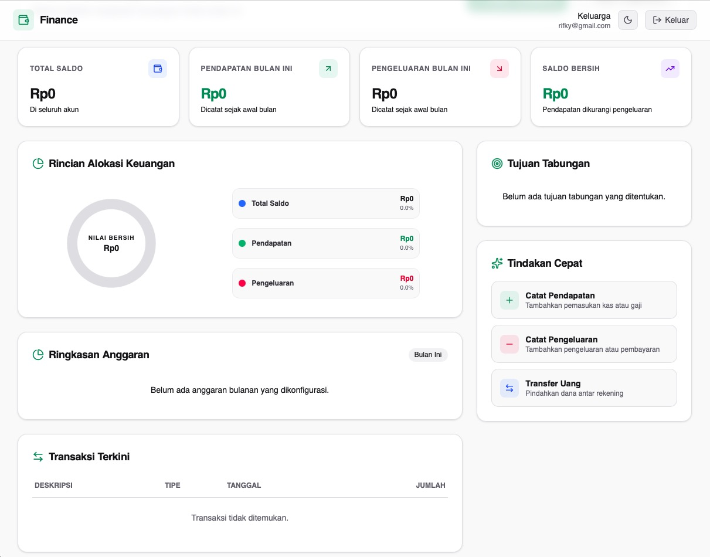

# Family Finance

Family Finance is a modern, personal finance management web application designed for a single family to collaboratively track income, expenses, budgets, and saving goals.



---

## 🛠️ Tech Stack

- **Frontend**: React (TypeScript), Vite, Tailwind CSS, shadcn/ui, React Router, TanStack Query, React Hook Form, Zod.
- **Backend & Database**: Supabase (PostgreSQL, GoTrue Auth, Row Level Security).
- **Deployment**: Vercel (Frontend), Supabase (Database/Auth).

---

## 📂 Project Structure

```
E-FF/
├── frontend/                 # Vite + React Frontend application
│   ├── src/
│   │   ├── assets/           # Static files
│   │   ├── components/       # Global UI components
│   │   ├── constants/        # Fixed variables
│   │   ├── features/         # Feature modules
│   │   ├── hooks/            # Custom React hooks
│   │   ├── layouts/          # Layout architectures
│   │   ├── pages/            # View pages
│   │   ├── routes/           # Routing configuration
│   │   ├── services/         # Supabase client and query services
│   │   ├── types/            # TypeScript definitions
│   │   └── utils/            # Helper functions
├── docs/                     # Technical specifications docs
│   ├── requirements.md       # Software Requirement Specification
│   ├── database.md           # Database Design
│   ├── ui-guideline.md       # Visual Guidelines
│   └── roadmap.md            # Development Milestones
├── .env.example              # Development environment variables template
└── README.md                 # Project Overview (This file)
```

---

## 🚀 Getting Started

### 1. Requirements
Ensure you have the following installed:
- [Node.js v20+](https://nodejs.org/) (for local frontend development)

### 2. Environment Setup
1. Copy the example environment file:
   ```bash
   cp .env.example .env
   cd frontend && cp ../.env.example .env
   ```
2. Fill in the `.env` variables using your Supabase project credentials (URL and Anon Key).

### 3. Local Development
1. Navigate to the frontend directory:
   ```bash
   cd frontend
   ```
2. Install dependencies:
   ```bash
   npm install
   ```
3. Start the Vite development server:
   ```bash
   npm run dev
   ```
   The frontend application will be active at http://localhost:5173.
