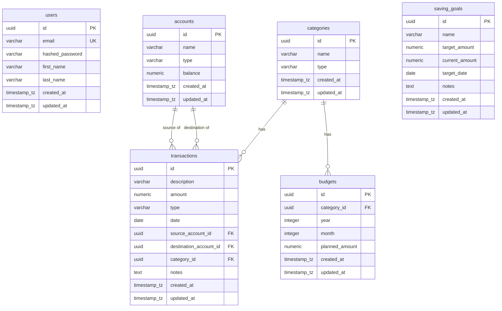

# Database Design Document - Family Finance

This document outlines the complete PostgreSQL database design for the **Family Finance** application, structured according to clean architecture, best practices, and the requirements detailed in [requirements.md](file:///Users/rifkykurniawan/Documents/WORK%21%21/Project/E-FF/docs/requirements.md).

---

## 1. Entity Relationship Diagram (ERD)



---

## 2. Table Specifications

### 2.1. `users` Table (Supabase `auth.users` / Public Profile)
Stores authenticated family members. In Supabase, the core authentication is handled by the built-in `auth.users` schema. We store additional metadata (like first and last names) in the `user_metadata` JSONB column of `auth.users`, or in a separate `public.profiles` table if complex relations are needed.

| Column Name (Logical) | Data Type | Constraints | Description |
| :--- | :--- | :--- | :--- |
| `id` | `UUID` | `PRIMARY KEY`, `DEFAULT gen_random_uuid()` | Unique identifier for each family member (maps to `auth.users.id`). |
| `email` | `VARCHAR(255)` | `UNIQUE`, `NOT NULL` | Login email identifier. |
| `user_metadata` | `JSONB` | `NULL` | Stores `first_name` and `last_name`. |
| `created_at` | `TIMESTAMPTZ` | `NOT NULL`, `DEFAULT now()` | Timestamp when user was created. |
| `updated_at` | `TIMESTAMPTZ` | `NOT NULL`, `DEFAULT now()` | Timestamp when user was last updated. |

---

### Row Level Security (RLS)
Since we are using Supabase directly from the frontend, **Row Level Security (RLS)** is mandatory.
- All tables must have RLS enabled: `ALTER TABLE table_name ENABLE ROW LEVEL SECURITY;`
- A general policy for this single-family application is to allow access to all authenticated users:
  `CREATE POLICY "Allow full access to authenticated users" ON table_name FOR ALL USING (auth.role() = 'authenticated');`

---

### 2.2. `accounts` Table
Tracks family accounts (bank accounts, e-wallets, cash, savings, etc.) and their current balances.

| Column Name | Data Type | Constraints | Description |
| :--- | :--- | :--- | :--- |
| `id` | `UUID` | `PRIMARY KEY`, `DEFAULT gen_random_uuid()` | Unique identifier for the account. |
| `name` | `VARCHAR(100)` | `NOT NULL`, `UNIQUE` | Human-readable name (e.g., "Dad's BCA", "Family Cash"). |
| `type` | `VARCHAR(50)` | `NOT NULL`, `CHECK (type IN ('Cash', 'Bank', 'E-Wallet', 'Savings', 'Investment'))` | Type classification of the account. |
| `balance` | `NUMERIC(15, 2)` | `NOT NULL`, `DEFAULT 0.00` | Current balance tracking. |
| `created_at` | `TIMESTAMPTZ` | `NOT NULL`, `DEFAULT now()` | Timestamp of creation. |
| `updated_at` | `TIMESTAMPTZ` | `NOT NULL`, `DEFAULT now()` | Timestamp of last modification. |

---

### 2.3. `categories` Table
User-defined categories for grouping income and expenses.

| Column Name | Data Type | Constraints | Description |
| :--- | :--- | :--- | :--- |
| `id` | `UUID` | `PRIMARY KEY`, `DEFAULT gen_random_uuid()` | Unique identifier for the category. |
| `name` | `VARCHAR(100)` | `NOT NULL` | Name of the category (e.g., "Groceries", "Salary"). |
| `type` | `VARCHAR(50)` | `NOT NULL`, `CHECK (type IN ('Income', 'Expense'))` | Category classification. |
| `created_at` | `TIMESTAMPTZ` | `NOT NULL`, `DEFAULT now()` | Timestamp of creation. |
| `updated_at` | `TIMESTAMPTZ` | `NOT NULL`, `DEFAULT now()` | Timestamp of last modification. |

*Unique Constraint:* `UNIQUE (name, type)` to prevent duplicate naming within the same category type.

---

### 2.4. `transactions` Table
Logs all financial operations: Incomes, Expenses, and Transfers.

| Column Name | Data Type | Constraints | Description |
| :--- | :--- | :--- | :--- |
| `id` | `UUID` | `PRIMARY KEY`, `DEFAULT gen_random_uuid()` | Unique identifier for the transaction. |
| `description` | `VARCHAR(255)` | `NOT NULL` | Description of the transaction. |
| `amount` | `NUMERIC(15, 2)` | `NOT NULL`, `CHECK (amount > 0)` | Monitored transaction value (always positive). |
| `type` | `VARCHAR(50)` | `NOT NULL`, `CHECK (type IN ('Income', 'Expense', 'Transfer'))` | Transaction type. |
| `date` | `DATE` | `NOT NULL`, `DEFAULT CURRENT_DATE` | Date transaction took place. |
| `source_account_id` | `UUID` | `FOREIGN KEY` references `accounts(id)` on delete restrict | Source account (for Expense and Transfer). |
| `destination_account_id` | `UUID` | `FOREIGN KEY` references `accounts(id)` on delete restrict | Destination account (for Income and Transfer). |
| `category_id` | `UUID` | `NULLABLE`, `FOREIGN KEY` references `categories(id)` on delete restrict | Associated category (mandatory for Income/Expense, NULL for Transfer). |
| `notes` | `TEXT` | `NULL` | Optional detailed notes. |
| `created_at` | `TIMESTAMPTZ` | `NOT NULL`, `DEFAULT now()` | Timestamp of ledger input. |
| `updated_at` | `TIMESTAMPTZ` | `NOT NULL`, `DEFAULT now()` | Timestamp of last transaction metadata update. |

---

### 2.5. `saving_goals` Table
Tracks specific target saving goals defined by the family.

| Column Name | Data Type | Constraints | Description |
| :--- | :--- | :--- | :--- |
| `id` | `UUID` | `PRIMARY KEY`, `DEFAULT gen_random_uuid()` | Unique identifier for the saving goal. |
| `name` | `VARCHAR(100)` | `NOT NULL` | Saving goal title (e.g., "Japan Trip 2027"). |
| `target_amount` | `NUMERIC(15, 2)` | `NOT NULL`, `CHECK (target_amount > 0)` | Target amount of money to save. |
| `current_amount` | `NUMERIC(15, 2)` | `NOT NULL`, `DEFAULT 0.00`, `CHECK (current_amount >= 0)` | Saved amount so far. |
| `target_date` | `DATE` | `NULL` | Target deadline to complete the savings. |
| `notes` | `TEXT` | `NULL` | Notes or description of goal parameters. |
| `created_at` | `TIMESTAMPTZ` | `NOT NULL`, `DEFAULT now()` | Timestamp of creation. |
| `updated_at` | `TIMESTAMPTZ` | `NOT NULL`, `DEFAULT now()` | Timestamp of last update. |

---

### 2.6. `budgets` Table
Defines spending limits for a specific category during a calendar month.

| Column Name | Data Type | Constraints | Description |
| :--- | :--- | :--- | :--- |
| `id` | `UUID` | `PRIMARY KEY`, `DEFAULT gen_random_uuid()` | Unique identifier for the budget entry. |
| `category_id` | `UUID` | `NOT NULL`, `FOREIGN KEY` references `categories(id)` on delete cascade | Category bound to this budget limit. |
| `year` | `INTEGER` | `NOT NULL` | Calendar year (e.g., 2026). |
| `month` | `INTEGER` | `NOT NULL`, `CHECK (month BETWEEN 1 AND 12)` | Calendar month (1 = Jan, 12 = Dec). |
| `planned_amount` | `NUMERIC(15, 2)` | `NOT NULL`, `CHECK (planned_amount >= 0)` | Allocated amount of money for the month. |
| `created_at` | `TIMESTAMPTZ` | `NOT NULL`, `DEFAULT now()` | Timestamp of budget setup. |
| `updated_at` | `TIMESTAMPTZ` | `NOT NULL`, `DEFAULT now()` | Timestamp of last modification. |

*Unique Constraint:* `UNIQUE (category_id, year, month)` to prevent multiple budgets for the same category in the same month.

---

## 3. Database Integrity & Constraints

### 3.1. Transaction Constraints (Conditional Checks)
To enforce business rules strictly inside the database layer, a check constraint is defined on `transactions`:

```sql
CONSTRAINT chk_transaction_rules CHECK (
    -- Income rules: Needs destination, needs category, no source
    (type = 'Income' AND destination_account_id IS NOT NULL AND source_account_id IS NULL AND category_id IS NOT NULL) OR
    -- Expense rules: Needs source, needs category, no destination
    (type = 'Expense' AND source_account_id IS NOT NULL AND destination_account_id IS NULL AND category_id IS NOT NULL) OR
    -- Transfer rules: Needs source, needs destination, they must be different, no category
    (type = 'Transfer' AND source_account_id IS NOT NULL AND destination_account_id IS NOT NULL AND source_account_id <> destination_account_id AND category_id IS NULL)
)
```

---

## 4. Performance Indexes

To support rapid retrieval of dashboards and report lookups, the following database indexes are established:

### 4.1. `transactions` Indexes
- **Date & Account Indexes** (For ledger rendering and balance calculation):
  - `idx_transactions_date`: `INDEX (date DESC)`
  - `idx_transactions_source_acc`: `INDEX (source_account_id)`
  - `idx_transactions_dest_acc`: `INDEX (destination_account_id)`
  - `idx_transactions_category`: `INDEX (category_id)`

### 4.2. `budgets` Indexes
- **Budget Lookup Index** (To quickly compute planned vs actual summaries):
  - `idx_budgets_lookup`: `INDEX (year, month, category_id)`
