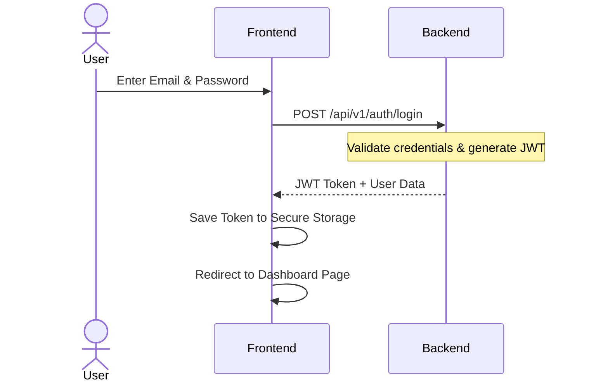
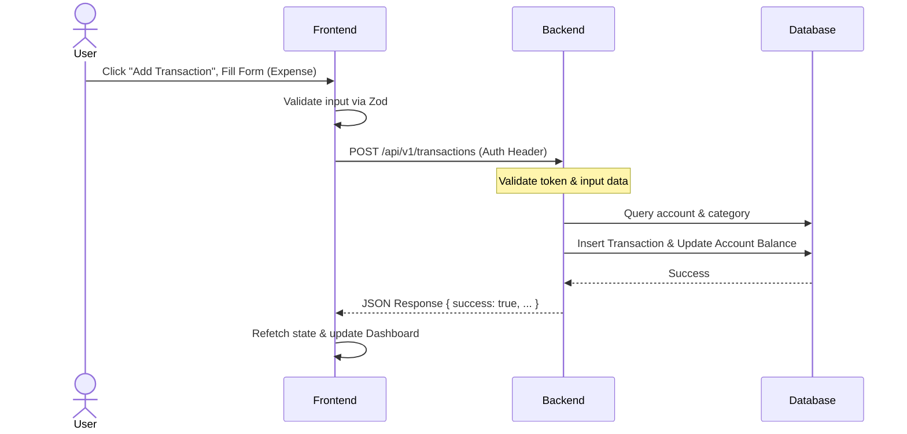
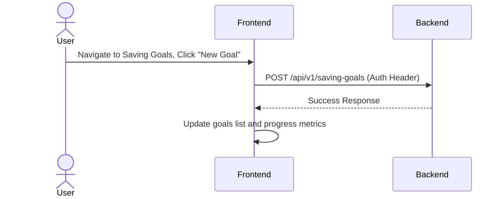

# Software Requirement Specification (SRS) - Family Finance

## 1. Project Overview
**Family Finance** is a modern, production-ready personal finance management web application designed for a single family. It is specifically built to help family members collaboratively track their income, expenses, transfers, monthly budgets, and savings goals. 

Unlike typical personal finance apps, Family Finance is **not a Software-as-a-Service (SaaS) application**. It is deployed as a private, single-instance installation for one family, meaning there is no multi-tenancy, no subscription billing, and no complex role-based access control. All family members share the same privileges to promote transparency and collaborative budgeting.

---

## 2. Project Goals
- **Promote Financial Transparency**: Enable all family members to view the family’s complete financial picture.
- **Collaborative Budgeting**: Allow family members to set monthly budgets by category and track joint expenses.
- **Goal Tracking**: Establish saving goals and automatically track savings progress.
- **Comprehensive Reporting**: Provide clear visualizations of income versus expenses, spending trends by category, and yearly summaries.
- **Simplicity & Reliability**: Deliver a clean, minimal user experience using a solid, maintainable tech stack without unnecessary enterprise overhead.

---

## 3. Functional Requirements

### 3.1. Authentication & Session Management
- **User Login**: Users must be able to log in securely using an email address and password.
- **JWT-Based Sessions**: Sessions must be authenticated using JSON Web Tokens (JWT) stored securely.
- **Protected Routes**: All pages and API endpoints (except login) must require valid JWT authentication.
- **No Roles/Permissions**: Every authenticated user possesses identical privileges (read, create, edit, delete). No admin panel or permission management is required.

### 3.2. Account Management
- **Multiple Accounts**: Users can create, update, and soft-delete (or delete if clean) an unlimited number of accounts.
- **Account Types**: Support for the following account types:
  - Cash
  - Bank
  - E-Wallet
  - Savings
  - Investment
- **Balance Tracking**: Each account maintains a running balance updated dynamically by transactions.

### 3.3. Category Management
- **Custom Categories**: Users can create, edit, and delete custom categories.
- **Category Types**: Each category belongs to exactly one of the following types:
  - Income Category
  - Expense Category

### 3.4. Transaction Management
- **Transaction Types**: Support three types of transactions:
  - **Income**: Increases the balance of a destination account. Associated with an Income Category.
  - **Expense**: Decreases the balance of a source account. Associated with an Expense Category.
  - **Transfer**: Moves funds from a source account to a destination account. A transfer does *not* count as income or an expense, and does not require a category (or can use an optional description/metadata).
- **Transaction Fields**: Name/Description, Amount, Date, Transaction Type, Source/Destination Account, Category (for Income/Expense), and optional Notes.

### 3.5. Monthly Budgeting
- **Optional Budgets**: Budgets can be created on a monthly basis for specific categories.
- **Budget Tracking**:
  - **Planned**: The amount of money allocated for the category.
  - **Actual**: The sum of all expenses in that category for the specified month.
  - **Remaining**: Calculated automatically as `Planned - Actual`.
- **Monthly Scoping**: Budgets are scoped to a specific calendar month and year.

### 3.6. Saving Goals
- **Goal Creation**: Users can create an unlimited number of saving goals.
- **Goal Fields**: Name, Target Amount, Current Amount, Target Date (optional), and Notes (optional).
- **Savings Logic**: Saving goals do not directly affect account balances. To fund a goal, the family must transfer money into an account marked as a `Savings` type. Progress of the saving goal is calculated automatically from the goal's target and current amounts.

### 3.7. Dashboard
- **Total Balance**: Aggregated balance of all active accounts (excluding/including specific types, or a simple total).
- **Income This Month**: Total income recorded in the current calendar month.
- **Expense This Month**: Total expenses recorded in the current calendar month.
- **Saving Goals Summary**: List of saving goals with progress bars.
- **Budget Summary**: A list/bar view of planned vs. actual budget performance.
- **Recent Transactions**: List of the most recent transactions across all accounts.
- **Expense by Category**: Visual breakdown (e.g., donut or pie chart) of current month's expenses by category.
- **Monthly Trend**: Chart showing income vs. expense trends over time.

### 3.8. Reports
- **Reports Views**:
  - Monthly reports
  - Yearly reports
  - Income vs. Expense analysis
  - Expense by Category charts
  - Saving Progress analysis
- **Exporting**: Design the architecture to allow future PDF and Excel report generation.

---

## 4. Non-Functional Requirements

### 4.1. Security
- **Password Hashing**: Passwords must be hashed using a secure hashing algorithm (e.g., bcrypt/Argon2) before storage. Plain text passwords must never be stored or logged.
- **Token Security**: JWTs must expire and be validated on every request.
- **Data Protection**: API responses must never expose sensitive info (e.g., hashed passwords).

### 4.2. Usability & UI Design
- **Responsive Layout**: The user interface must support desktop, tablet, and mobile browsers seamlessly.
- **Modern & Minimalist**: Built using shadcn/ui components with a clean and minimal design system. Avoid unnecessary animations to keep the interface fast and functional.

### 4.3. Performance & Reliability
- **Fast Load Times**: The SPA must be lightweight and load quickly over standard network connections.
- **Validation**: Strict validation on both the Frontend (React Hook Form + Zod) and Backend (Pydantic v2). The system must never trust frontend input.
- **Database integrity**: PostgreSQL database with foreign key constraints, using UUIDs for primary keys, and tracking `created_at` and `updated_at` timestamps on all tables.

### 4.4. Maintenance & Logging
- **Structured Logging**: Backend application must use structured logging.
- **Audit Trails**: Log critical operations such as application startup, user logins, and database write errors. Do not log passwords or authentication tokens.

---

## 5. User Flows

### 5.1. Authentication Flow

### 5.2. Logging a Transaction (Expense)

### 5.3. Managing a Saving Goal

---

## 6. Business Rules
1. **Single-Family Domain**: All registered users are part of the same family and share access to all accounts, categories, budgets, and transactions.
2. **Transaction Balance Impact**:
   - **Income**: Account Balance = Current Balance + Transaction Amount.
   - **Expense**: Account Balance = Current Balance - Transaction Amount.
   - **Transfer**: Source Account Balance = Current Balance - Transfer Amount. Destination Account Balance = Current Balance + Transfer Amount.
3. **Transfer Independence**: Transfers do not carry an income or expense category and do not count toward total monthly income or total monthly expense metrics.
4. **Budget Exclusivity**: A monthly budget is uniquely bound to a single category and a single month. Multiple budgets for the same category in the same month are not allowed.

---

## 7. Assumptions
- **Single Instance Deployment**: The app runs on a single Railway/Vercel instance with a single PostgreSQL database server. No horizontal scaling or region synchronization is required.
- **Family Trust**: Since all members have identical access levels, it is assumed that family members will not intentionally delete or alter other members' transactions maliciously.
- **Manual Backups**: Database backup and restore operations are handled at the database provider level (e.g., Railway/PostgreSQL hosting tools) rather than inside the app.

---

## 8. Out of Scope
- **Multi-tenancy / SaaS Features**: No organization creation, subscription billing, plan limits, or account isolation between families.
- **Bank Syncing / API Integration**: No automatic importing of bank statements or third-party bank integration APIs (e.g., Plaid). All transactions must be inputted manually.
- **Role-Based Access Control (RBAC)**: No "Admin", "Parent", or "Child" roles.
- **Automated Bill Payments**: The application will not interact with financial institutions to pay bills or execute actual transfers.

---

## 9. Feature List
1. **Authentication Dashboard**: Login page, JWT token management, auto-logout on expiration.
2. **Account Center**: List accounts, add new accounts (Cash, Bank, E-Wallet, Savings, Investment), edit details, view individual account ledger.
3. **Category Manager**: Add, edit, and delete custom categories, classified by Income or Expense.
4. **Transaction Log**: Unified list of transactions with filtering (by type, account, date range, category) and search. Form to create/edit/delete Income, Expense, and Transfer transactions.
5. **Monthly Budget Planner**: Grid or list view of categories for the current month showing: Planned, Actual, and Remaining amounts. Ability to set or adjust planned budgets.
6. **Savings Goal Tracker**: Visual dashboard of all saving goals, detailing progress percentage, target amount, current amount, and remaining time.
7. **Reports & Analytics**: Charts (Pie/Donut/Line) highlighting spending by category, monthly income vs expense comparison, and historical trend lines.

---

## 10. Acceptance Criteria

### 10.1. Authentication
- **AC 1**: User cannot view any dashboard, account, budget, or transaction data without a valid JWT token.
- **AC 2**: Invalid login credentials must return a clear validation error without exposing details of the hashing mechanism.

### 10.3. Accounts
- **AC 3**: Creating an account must require a non-empty name and a valid account type selection.
- **AC 4**: When an account is created, its initial balance must be saved. Any subsequent transaction (Income, Expense, Transfer) must correctly update the balance.

### 10.4. Categories & Transactions
- **AC 5**: An Expense transaction cannot be assigned to an Income Category, and vice versa.
- **AC 6**: A Transfer transaction must fail validation if the source account and destination account are the same.
- **AC 7**: Deleting a transaction must revert the balance change of the associated accounts.

### 10.5. Budgets
- **AC 8**: Actual expenses must automatically sum up in real-time under the correct category and month in the Budget view.
- **AC 9**: Remaining budget column must display a negative value and be visually highlighted (e.g., colored red) if the actual expense exceeds the planned budget.

### 10.6. Saving Goals
- **AC 10**: The saving goal progress bar must accurately display the percentage of `Current Amount / Target Amount`.
- **AC 11**: Editing a saving goal's current amount must update the calculated progress immediately.
