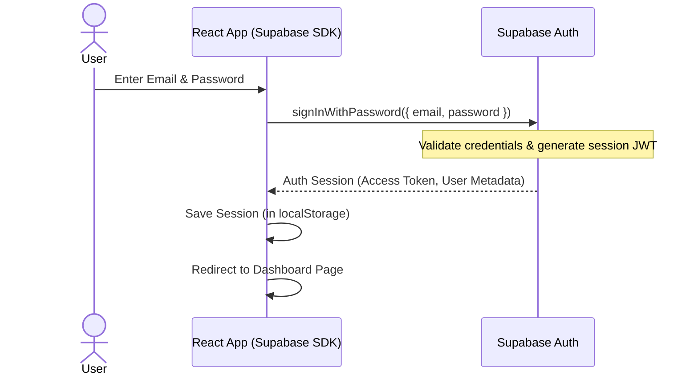
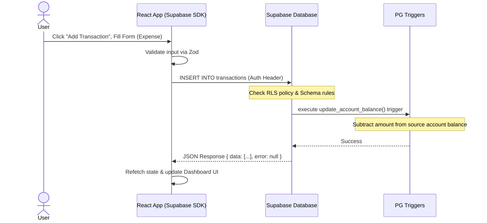
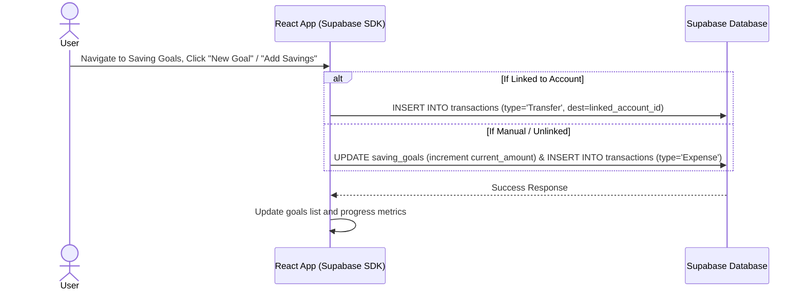

# Software Requirement Specification (SRS) - Family Finance

## 1. Project Overview
**Family Finance** is a modern, production-ready personal finance management web application designed for a single family. It allows family members to sign up and manage their own financial datasets.

Each registered user has complete data isolation—meaning 1 account corresponds to exactly 1 distinct set of accounts, categories, transactions, budgets, and saving goals. Access control is enforced at the database level using Row Level Security (RLS) policies.

---

## 2. Project Goals
- **Personalized Finance Scoping**: Ensure each user manages their own isolated finance space.
- **Goal Tracking**: Establish saving goals and automatically track savings progress.
- **Comprehensive Reporting**: Provide clear visualizations of income versus expenses, spending trends by category, and yearly summaries.
- **Simplicity & Reliability**: Deliver a clean, minimal user experience using a solid, maintainable tech stack without unnecessary enterprise overhead.

---

## 3. Functional Requirements

### 3.1. Authentication & Session Management
- **User Registration (Sign Up)**: Anyone can register an account by providing first name, last name, email, and password.
- **Administrator Approval (Verification)**: Newly registered users are unverified by default. The only way to verify/activate an account is by updating the `is_verified` flag directly in the database. Only verified accounts are allowed to log in and restore sessions.
- **User Login**: Users must be able to log in securely using an email address and password once approved.
- **JWT-Based Sessions**: Sessions must be authenticated using JSON Web Tokens (JWT) stored securely.
- **Protected Routes**: All pages and API endpoints (except login and signup) must require valid JWT authentication.
- **No Roles/Permissions**: Every verified user possesses identical privileges (read, create, edit, delete) over their own data. No admin panel or permission management is required.

### 3.2. Account Management
- **Multiple Accounts**: Users can create, update, and soft-delete (or delete if clean) an unlimited number of accounts.
- **Account Types**: Support for the following account types:
  - Cash
  - Bank
  - E-Wallet
  - Savings
  - Investment
- **Balance Tracking**: Each account maintains a running balance updated dynamically by transactions.

### 3.3. Category Management
- **Custom Categories**: Users can create, edit, and delete custom categories.
- **Category Types**: Each category belongs to exactly one of the following types:
  - Income Category
  - Expense Category

### 3.4. Transaction Management
- **Transaction Types**: Support three types of transactions:
  - **Income**: Increases the balance of a destination account. Associated with an Income Category.
  - **Expense**: Decreases the balance of a source account. Associated with an Expense Category.
  - **Transfer**: Moves funds from a source account to a destination account. A transfer does *not* count as income or an expense, and does not require a category (or can use an optional description/metadata).
- **Transaction Fields**: Name/Description, Amount, Date, Transaction Type, Source/Destination Account, Category (for Income/Expense), and optional Notes.

### 3.5. Monthly Budgeting
- **Optional Budgets**: Budgets can be created on a monthly basis for specific categories.
- **Budget Tracking**:
  - **Planned**: The amount of money allocated for the category.
  - **Actual**: The sum of all expenses in that category for the specified month.
  - **Remaining**: Calculated automatically as `Planned - Actual`.
- **Monthly Scoping**: Budgets are scoped to a specific calendar month and year.

### 3.6. Saving Goals
- **Goal Creation**: Users can create an unlimited number of saving goals.
- **Goal Fields**: Name, Target Amount, Current Amount, Target Date (optional), Notes (optional), and Account Link (optional, maps to an account ID).
- **Savings Logic**: Saving goals can be optionally linked to a specific account:
  - **Linked Goals**: The progress/current amount is dynamically derived from the balance of the linked account. To contribute to the goal, money is transferred into the linked account (using a Transfer transaction).
  - **Manual/Unlinked Goals**: The goal maintains its own static `current_amount`. To contribute, the user logs a savings contribution which directly increments the goal's current amount and logs a corresponding Expense transaction from the source account.

### 3.7. Dashboard
- **Total Balance**: Aggregated balance of all active accounts (excluding/including specific types, or a simple total).
- **Income This Month**: Total income recorded in the current calendar month.
- **Expense This Month**: Total expenses recorded in the current calendar month.
- **Saving Goals Summary**: List of saving goals with progress bars.
- **Budget Summary**: A list/bar view of planned vs. actual budget performance.
- **Recent Transactions**: List of the most recent transactions across all accounts.
- **Expense by Category**: Visual breakdown (e.g., donut or pie chart) of current month's expenses by category.
- **Monthly Trend**: Chart showing income vs. expense trends over time.

### 3.8. Reports
- **Reports Views**:
  - Monthly reports
  - Yearly reports
  - Income vs. Expense analysis
  - Expense by Category charts
  - Saving Progress analysis
- **Exporting**: Design the architecture to allow future PDF and Excel report generation.

---

## 4. Non-Functional Requirements

### 4.1. Security
- **Auth Provider**: Managed fully via Supabase Auth (GoTrue API).
- **Password Security**: Passwords are securely hashed and stored within Supabase's internal auth schemas.
- **Session Security**: Sessions are verified via JWT tokens automatically handled by the Supabase Client SDK and enforced at the database level using Row Level Security (RLS).

### 4.2. Usability & UI Design
- **Responsive Layout**: The user interface supports desktop, tablet, and mobile browsers seamlessly. On mobile viewports, the sidebar converts into a collapsible mobile drawer menu toggled by a hamburger button.
- **Modern & Minimalist**: Built using shadcn/ui components with a clean and minimal design system. Avoid unnecessary animations to keep the interface fast and functional.

### 4.3. Performance & Reliability
- **Fast Load Times**: The SPA is lightweight and loads quickly over standard network connections.
- **Validation**: Strict validation on the Frontend (React Hook Form + Zod) and Database level (PostgreSQL check constraints, triggers, and foreign keys). The database rejects invalid actions as a second layer of defense.
- **Database Integrity**: PostgreSQL database with foreign key constraints, using UUIDs for primary keys, and tracking `created_at` and `updated_at` timestamps on all tables.

### 4.4. Maintenance & Logging
- **Database Logs**: Relies on Supabase Database logging features.
- **Frontend Debugging Logs**: Client-side console logging is limited to debugging output and must never leak JWTs or passwords.

---

## 5. User Flows

### 5.1. Authentication Flow

```mermaid
sequenceDiagram
    actor User
    participant Frontend as React App (Supabase SDK)
    participant Supabase as Supabase Auth
    User->>Frontend: Enter Email & Password
    Frontend->>Supabase: signInWithPassword({ email, password })
    Note over Supabase: Validate credentials & generate session JWT
    Supabase-->>Frontend: Auth Session (Access Token, User Metadata)
    Frontend->>Frontend: Save Session (in localStorage)
    Frontend->>Frontend: Redirect to Dashboard Page
```

### 5.2. Logging a Transaction (Expense)

```mermaid
sequenceDiagram
    actor User
    participant Frontend as React App (Supabase SDK)
    participant DB as Supabase Database
    participant Triggers as PG Triggers
    User->>Frontend: Click "Add Transaction", Fill Form (Expense)
    Frontend->>Frontend: Validate input via Zod
    Frontend->>DB: INSERT INTO transactions (Auth Header)
    Note over DB: Check RLS policy & Schema rules
    DB->>Triggers: execute update_account_balance() trigger
    Note over Triggers: Subtract amount from source account balance
    Triggers-->>DB: Success
    DB-->>Frontend: JSON Response { data: [...], error: null }
    Frontend->>Frontend: Refetch state & update Dashboard UI
```

### 5.3. Managing a Saving Goal

```mermaid
sequenceDiagram
    actor User
    participant Frontend as React App (Supabase SDK)
    participant DB as Supabase Database
    User->>Frontend: Navigate to Saving Goals, Click "New Goal" / "Add Savings"
    alt If Linked to Account
        Frontend->>DB: INSERT INTO transactions (type='Transfer', dest=linked_account_id)
    else If Manual / Unlinked
        Frontend->>DB: UPDATE saving_goals (increment current_amount) & INSERT INTO transactions (type='Expense')
    end
    DB-->>Frontend: Success Response
    Frontend->>Frontend: Update goals list and progress metrics
```

---

## 6. Business Rules
1. **User Workspace Isolation**: Each registered user has their own completely isolated workspace (accounts, transactions, categories, budgets, and saving goals). There is no sharing of financial data between users. Row Level Security (RLS) policies enforce this isolation at the database level.
2. **Transaction Balance Impact**:
   - **Income**: Account Balance = Current Balance + Transaction Amount.
   - **Expense**: Account Balance = Current Balance - Transaction Amount.
   - **Transfer**: Source Account Balance = Current Balance - Transfer Amount. Destination Account Balance = Current Balance + Transfer Amount.
3. **Transfer Independence**: Transfers do not carry an income or expense category and do not count toward total monthly income or total monthly expense metrics.
4. **Budget Exclusivity**: A monthly budget is uniquely bound to a single category and a single month. Multiple budgets for the same category in the same month are not allowed.

---

## 7. Assumptions
- **Single Instance Deployment**: The app runs on a single Vercel instance connected to a single Supabase PostgreSQL database server. No horizontal scaling or region synchronization is required.
- **Family Trust**: Since all members have identical access levels, it is assumed that family members will not intentionally delete or alter other members' transactions maliciously.
- **Manual Backups**: Database backup and restore operations are handled at the database provider level (e.g., Supabase dashboard tools) rather than inside the app.

---

## 8. Out of Scope
- **Multi-tenancy / SaaS Features**: No organization creation, subscription billing, plan limits, or account isolation between families.
- **Bank Syncing / API Integration**: No automatic importing of bank statements or third-party bank integration APIs (e.g., Plaid). All transactions must be inputted manually.
- **Role-Based Access Control (RBAC)**: No "Admin", "Parent", or "Child" roles.
- **Automated Bill Payments**: The application will not interact with financial institutions to pay bills or execute actual transfers.

---

## 9. Feature List
1. **Authentication Dashboard**: Login page, Supabase session management, auto-logout on expiration.
2. **Account Center**: List accounts, add new accounts (Cash, Bank, E-Wallet, Savings, Investment), edit details, view individual account ledger.
3. **Category Manager**: Add, edit, and delete custom categories, classified by Income or Expense.
4. **Transaction Log**: Unified list of transactions with filtering (by type, account, date range, category) and search. Form to create/edit/delete Income, Expense, and Transfer transactions.
5. **Monthly Budget Planner**: Grid or list view of categories for the current month showing: Planned, Actual, and Remaining amounts. Ability to set or adjust planned budgets.
6. **Savings Goal Tracker**: Visual dashboard of all saving goals, detailing progress percentage, target amount, current amount, and remaining time.
7. **Reports & Analytics**: Charts (Pie/Donut/Line) highlighting spending by category, monthly income vs expense comparison, and historical trend lines.

---

## 10. Acceptance Criteria

### 10.1. Authentication
- **AC 1**: User cannot view any dashboard, account, budget, or transaction data without a valid Supabase session.
- **AC 2**: Invalid login credentials must return a clear validation error from Supabase Auth.

### 10.3. Accounts
- **AC 3**: Creating an account must require a non-empty name and a valid account type selection.
- **AC 4**: When an account is created, its initial balance must be saved. Any subsequent transaction (Income, Expense, Transfer) must correctly update the balance.

### 10.4. Categories & Transactions
- **AC 5**: An Expense transaction cannot be assigned to an Income Category, and vice versa.
- **AC 6**: A Transfer transaction must fail validation if the source account and destination account are the same.
- **AC 7**: Deleting a transaction must revert the balance change of the associated accounts.

### 10.5. Budgets
- **AC 8**: Actual expenses must automatically sum up in real-time under the correct category and month in the Budget view.
- **AC 9**: Remaining budget column must display a negative value and be visually highlighted (e.g., colored red) if the actual expense exceeds the planned budget.

### 10.6. Saving Goals
- **AC 10**: The saving goal progress bar must accurately display the percentage of `Current Amount / Target Amount`. If the goal is linked to an account, the current amount is dynamically retrieved from the linked account's balance.
- **AC 11**: Adding savings to a goal:
  - For goals linked to an account, a Transfer transaction must be created, and the balance of the linked account increases (updating the goal progress).
  - For goals not linked to an account, the goal's `current_amount` is directly updated, and an Expense transaction must be logged.

